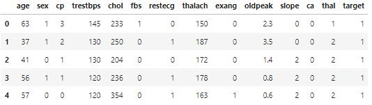
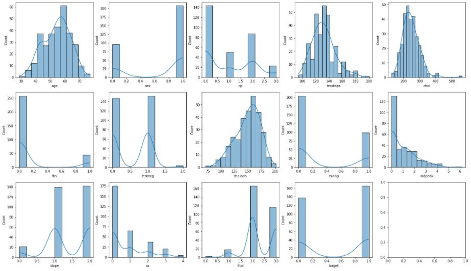

# Развертывание модели машинного обучения в Production
Необходимо создать FastApi приложение для модели классификации и развернуть данное приложение локально при помощи Docker. Протестировать Get запросы (направляя X вектор переменных) и получить Response в виде целевой переменной. Исходные данные доступны по ссылке https://www.kaggle.com/ronitf/heart-disease-uci

## Docker-файл
```python
FROM python
COPY . /app
WORKDIR /app
RUN pip install numpy pandas scikit-learn fastapi uvicorn
EXPOSE 8000
CMD ["python", "main.py"]
```

## Production-файл модели
```python
# Импорт основных библиотек
import numpy as np
import pandas as pd

# Импорт библиотек машинного обучения
from sklearn.model_selection import train_test_split
from sklearn.pipeline import Pipeline
from sklearn.compose import ColumnTransformer
from sklearn.preprocessing import OneHotEncoder
from sklearn.feature_selection import VarianceThreshold, SelectKBest, chi2
from sklearn.metrics import roc_auc_score
from sklearn.naive_bayes import GaussianNB

# Импорт библиотеки построения WebApi-серверов
from fastapi import FastAPI
from pydantic import BaseModel

# Импорт библиотеки web-сервера
import uvicorn

# Определение класса Пациент
class Patient(BaseModel):
    age: int = 63
    sex: int = 1
    cp: int = 3
    trestbps: int = 145
    chol: int = 233
    fbs: int = 1
    restecg: int = 0
    thalach: int = 150
    exang: int = 0
    oldpeak: float = 2.3
    slope: int = 0
    ca: int = 0
    thal: int = 1

# Функция построения модели классификации
def create_model():
    # Загрузка исходных данных
    data = pd.read_csv('heart.csv', low_memory=True)

    # Разбиение данных на признаки и целевые переменные
    X_train, X_test, Y_train, Y_test = train_test_split(
        data.iloc[:, :-1], data.iloc[:, -1], stratify=data.iloc[:, -1], train_size=0.8, random_state=42)

    # Определение списка категориальных признаков
    catigorical_features = [column for i, column in enumerate(data.columns[:-1])
                                   if len(data.iloc[:, i].unique()) < 20]
    # Построение модели классификации
    preprocessor = ColumnTransformer(
        [('encoder', OneHotEncoder(sparse=False), catigorical_features)],
        remainder='passthrough')

    pipeline = Pipeline([
        ('preprocess', preprocessor),
        ('var_select', VarianceThreshold(0.001)),
        ('chi2_select', SelectKBest(chi2, k=20)),
        ('classifier', GaussianNB())])

    model = pipeline.fit(X_train, Y_train)

    # Определение оценки качества модели
    score = roc_auc_score(Y_test, model.predict(X_test))

    return model, score, X_train.columns

model, score, column_names = create_model()

# Создание объекта приложения FastApi
app = FastAPI()

# Информация о модели классификации
@app.get('/model')
async def get_model():
    return {'Модель': 'Байесовский классификатор',
            'ROC-AUC': np.round(score, 2)}

# Предсказание результатов моделью классификации
@app.post('/predict')
async def predict(item: Patient):
    data = pd.DataFrame(np.array([item.age, item.sex, item.cp, item.trestbps, item.chol, item.fbs, item.restecg,
                                  item.thalach, item.exang, item.oldpeak, item.slope, item.ca, item.thal])[None, ...],
                        columns=column_names)
    prediction = model.predict(data).tolist()[0]

    return {'Наличие болезни сердца: ': prediction}

# Запуск web-сервера
if __name__=='__main__':
    uvicorn.run('main:app', host='0.0.0.0')
```

## Исследование модели машинного обучения
### Подключение библиотек
```python
# Импорт основных библиотек
import numpy as np
import pandas as pd

# Импорт библиотек построения диаграмм и графиков
import matplotlib.pyplot as plt
import seaborn as sns

# Импорт библиотек машинного обучения
from sklearn.model_selection import train_test_split
from sklearn.pipeline import Pipeline
from sklearn.compose import ColumnTransformer
from sklearn.preprocessing import OneHotEncoder
from sklearn.feature_selection import VarianceThreshold, SelectKBest, chi2
from sklearn.metrics import roc_auc_score
from sklearn.naive_bayes import GaussianNB

# Определение режима вывода диаграмм
%matplotlib inline
```

### Загрузка исходных данных
```python
heart_database = pd.read_csv('heart.csv', low_memory=True)
heart_database.head()
```


### Разведочный анализ данных
```python
# Вывод информации о структуре исходных данных
heart_database.info()
```
```
<class 'pandas.core.frame.DataFrame'>
RangeIndex: 303 entries, 0 to 302
Data columns (total 14 columns):
 #   Column    Non-Null Count  Dtype  
---  ------    --------------  -----  
 0   age       303 non-null    int64  
 1   sex       303 non-null    int64  
 2   cp        303 non-null    int64  
 3   trestbps  303 non-null    int64  
 4   chol      303 non-null    int64  
 5   fbs       303 non-null    int64  
 6   restecg   303 non-null    int64  
 7   thalach   303 non-null    int64  
 8   exang     303 non-null    int64  
 9   oldpeak   303 non-null    float64
 10  slope     303 non-null    int64  
 11  ca        303 non-null    int64  
 12  thal      303 non-null    int64  
 13  target    303 non-null    int64  
dtypes: float64(1), int64(13)
memory usage: 33.3 KB
```

```python
# Вывод распределения признаков
fig, axes = plt.subplots(3, 5, figsize=(24, 14))

for i in range(len(heart_database.columns)):
    sns.histplot(heart_database.iloc[:, i], kde=True, ax=axes.flatten()[i])

# Вывод диаграммы
plt.show()
```


### Предварительная обработка данных
```python
# Разбиение данных на признаки и целевые переменные
X_train, X_test, Y_train, Y_test = train_test_split(
    heart_database.iloc[:, :-1], heart_database.iloc[:, -1], 
    stratify=heart_database.iloc[:, -1], train_size=0.8, random_state=42)
```

### Построение моделей
```python
# Определение списка категориальных признаков
catigorical_features = [column for i, column in enumerate(heart_database.columns[:-1]) 
                        if len(heart_database.iloc[:, i].unique()) < 20]

# Построение модели классификации
preprocessor = ColumnTransformer(
    [('encoder', OneHotEncoder(sparse=False), catigorical_features)], 
    remainder='passthrough')

pipeline = Pipeline([
    ('preprocess', preprocessor),
    ('var_select', VarianceThreshold(0.001)), 
    ('chi2_select', SelectKBest(chi2, k=20)),
    ('classifier', GaussianNB())])

model = pipeline.fit(X_train, Y_train)

# Вывод оценки качества модели
score = roc_auc_score(Y_test, model.predict(X_test))
print('ROC-AUC: {:0.2f}'.format(score))
```
```
ROC-AUC: 0.87
```
